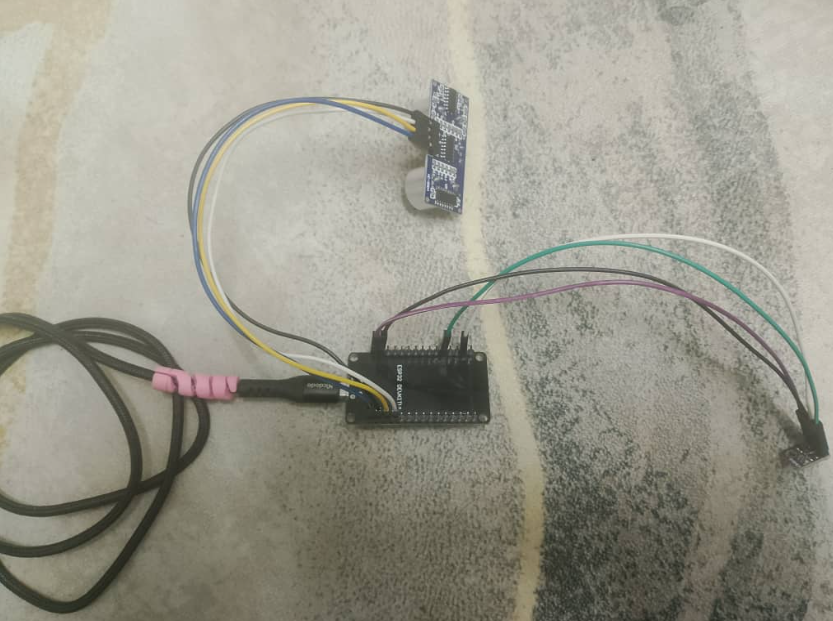

# Hardware Assembly Guide

## Step-by-Step Assembly Instructions

1. **Prepare Components**
   - ESP32 Development Board
   - BME280 Sensor Module
   - HC-SR04 Ultrasonic Sensor
   - Breadboard
   - Jumper wires (male-to-male)

2. **Connect BME280 to ESP32**
   - VCC → 3.3V
   - GND → GND
   - SCL → GPIO22
   - SDA → GPIO21

3. **Connect HC-SR04 to ESP32**
   - VCC → 5V (VIN pin)
   - GND → GND
   - Trig → GPIO12
   - Echo → GPIO13

4. **Power the System**
   - Connect ESP32 to computer via USB cable
   - Verify power LED turns on

5. **Test Individual Sensors**
   - Upload test code to verify BME280 readings
   - Test HC-SR04 distance measurement

## High-Quality Photos of Assembled Hardware

### Full Front View

### Top View

### BME280 Close-Up

### HC-SR04 Close-Up

### System Powered On

## Troubleshooting Tips
- If BME280 not detected: Check I2C address (usually 0x76)
- If HC-SR04 gives 0 cm: Check wiring and avoid reflective surfaces close by
- Use level shifter if signal issues (rare with ESP32)

This setup is reproducible and was tested successfully.