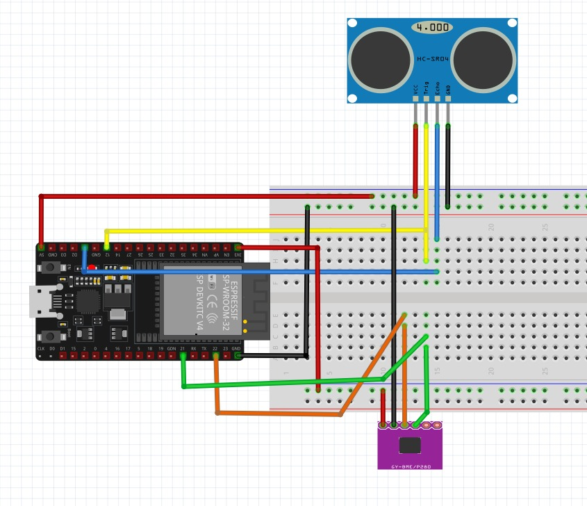

# Hardware Documentation

## Components Used
- ESP32 Development Board (NodeMCU-32S or similar)
- BME280 Environmental Sensor (Temperature, Humidity, Pressure)
- HC-SR04 Ultrasonic Distance Sensor
- Breadboard and jumper wires

## Pin Connections

### BME280 (I2C)
| BME280 Pin | ESP32 Pin | Notes                  |
|------------|-----------|------------------------|
| VCC        | 3.3V      | Use 3.3V only          |
| GND        | GND       |                        |
| SCL        | GPIO22    | I2C Clock              |
| SDA        | GPIO21    | I2C Data               |

### HC-SR04 (Ultrasonic)
| HC-SR04 Pin | ESP32 Pin | Notes                  |
|------------|-----------|------------------------|
| VCC        | 5V (VIN)  | Can use 5V pin         |
| GND        | GND       |                        |
| Trig       | GPIO12    | Trigger pulse output   |
| Echo       | GPIO13    | Echo pulse input       |

## Circuit Diagrams

### BME280 Wiring

### HC-SR04 Wiring

### Full Breadboard Layout

## Notes
- BME280 address: 0x76 (default)
- No pull-up resistors needed (ESP32 has internal)
- HC-SR04 works reliably with 5V power; signals are 3.3V tolerant
- Sensor inconsistencies in project spec (DHT22/LDR mentioned) were resolved by using specified essential components: BME280 and HC-SR04